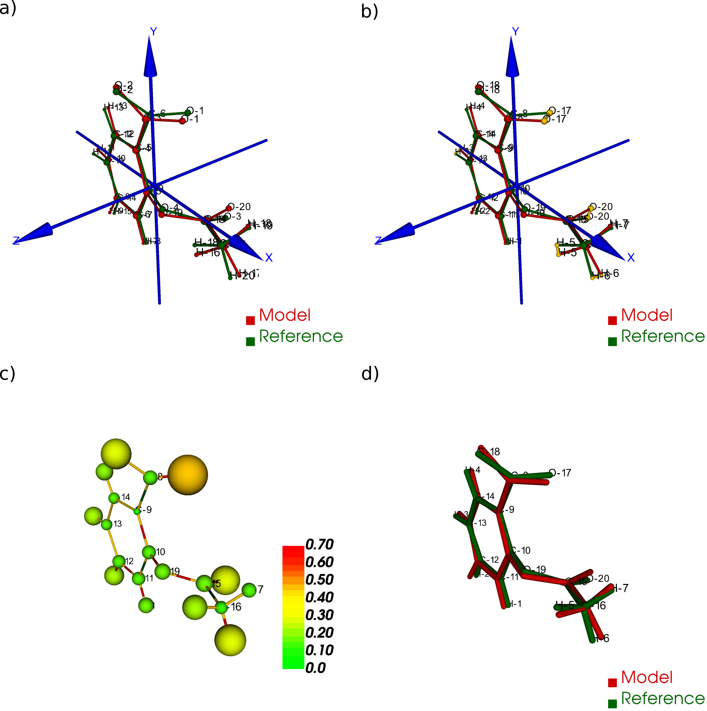

# file name: README.org
# last edit: [2026-07-17 Fri]
#+AUTHOR:  Norwid Behrnd
#+TITLE:
#+DATE:

#+OPTIONS: toc:nil

  [[./aRMSD_logo.png]]

  =aRMSD= allows the manual the comparison of two constitutionally
  identical small molecule structures by the Kabsch
  algorithm[fn:Kabsch].  In addition to the original approach to
  account only for atomic positions, =aRMSD= provides adjustable
  weights, for instance to equally account for X-ray scattering
  factors (for instance Mo K(alpha) radition).  The results of the
  superposition can be accessed as interactive renderings by
  =vtk=,[fn:vtk] while statistics are visualized in diagrams generated
  by =matplotlib=.[fn:matplotlib] The development of the software was
  started prior to 2016 by Arne Wagner during his PhD thesis in the
  Himmel group (University of Heidelberg,
  Germany)[fn:aRMSD_paper],[fn:Wagner-PhD] and distributed on
  https://github.com/armsd/aRMSD under the MIT license scheme.

  The current version 1.0.0 reorganizes the project for an easier
  installation and subsequent use with Python 3.10 (and above),
  agnostic to the operating system at hand.  This is the reason why
  the primary input format of data to process should be =.xyz=, or
  (second best choice:) =.pdb= in the syntax written by
  OpenBabel.[fn:babel] Contrasting to earlier releases, correct
  processing of =.cif= or output files by quantum mechanical programs
  (Gaussian, MOPAC, etc) can not be guaranteed.

* What may aRMSD do for you -- an appetizer

  As shown in the figure below, =aRMSD= may be used to align the
  models (a) and reorder the atom order by the Hungarian
  algorithm (b). Subsequently, the superposition is optimized by
  minimization of the RMSD according to the Kabsch algorithm.

  #+ATTR_LATEX:    :width 15cm
  #+ATTR_HTML:     :width 75%
  

  In a newly designed interactive representation (c), the differences
  between the two models are shown: atoms drawn with larger diameter
  indicate a larger /relative/ contribution to the final RMSD
  determined for the complete model.  Their color corresponds to the
  scale at the side about /absolute/ positional differences (in
  Angstroms) of said atom in in reference and model in the optimized
  superposition.

  In addition, =aRMSD= the program compares the corresponding bond
  lengths of model and reference indicates either by green or red
  color encoding if the one by the model is shorter, or lengthier than
  the corresponding bond in the reference.  Not shown here, but
  =aRMSD= allows the interactive readout of the differences found for
  selected bond lengths, angles, and dihedral angles, too.

  =aRMSD= equally provides a more classical (yet interactive)
  visualization of the optimized superposition (d).  This "best fit"
  determined may be saved as a =.xyz= file, or as a set of 10 files
  about structure between model and reference.

  In addition to an optional permanent log file (=aRSMD_logfile.out=)
  about setup and results of the superposition (e.g., final rmsd,
  cosine similarity, and GARD score[fn:GARD]), the user may complement
  the scrutiny with diagrams.  Generated by =matplotlib=, it is
  possible to pan and zoom regions of interest.  The export includes
  formats like =.png=, =.pdf=, or =.tikz=.

  #+ATTR_LATEX:  :width 15cm
  #+ATTR_HTML:   :width 75%
  [[./aRMSD-aspirinateStatistics.png]]

* Where stands aRMSD, relatively to other programs?

  =aRMSD= allows a pair-wise comparison of small molecule structures
  with significant user-interaction.  This offers you multiple levels
  to check and adjust the progress of the analysis.  A more automatic
  analysis, potentially over batches of structures, is not foreseen;
  if interested, see for instance Jimmy Kromann's [[https://github.com/charnley/rmsd][rmsd]] (equally
  implemented in Python).

  Note, however, that an automated unsupervised scrutiny of model data
  may yield wrong results.  One potential pitfall is how the model
  information is handled prior to the refinement of the structure
  alignment, where =aRMSD= uses the Hungarian algorithm.  To quote
  Kildgaard:[fn:Kildgaard]

  #+LATEX:  \begin{quote}
  "The RMSD can be minimized by translating and rotating one set of
  coordinates (the other is held fixed) because the molecules are
  invariant under these operations. This will lead to the two
  molecules being superimposed but can also lead to a false RMSD value
  if the atoms are not ordered identically."
  #+LATEX:  \end{quote}

  which was further demonstrated (and illustrated) for instance by
  Temeslo.[fn:Temeslo]

* Proposed installation and use

  =aRMSD= preferably is used in a virtual environment of Python 3.11
  (or above) to resolve its dependencies by [[https://pypi.org/][pypi.org]] and file
  =pyproject.toml=.  Depending on Python version and operating system,
  this support can add up to about 1GB permanent memory.  With the
  =.whl= at disposition (release page of the GitHub repository, or
  built by =uv build= from the GitHub repository), the installation
  with =pip= provides =armsd= (all lower case) as new initial command
  to the CLI.

  When running =aRMSD= from the CLI, ensure the terminal is tall
  enough (e.g., 40 rows instead of only 24; a width of 80 characters
  however is fine).  Else you may miss some of its rolling interface,
  and commands at disposition.  For details, see folder =docs= or the
  primer on [[https://armsd-primer.readthedocs.io/][armsd-primer.readthedocs.io]].

* Footnotes

[fn:babel] Open Babel, [[http://openbabel.org/wiki/Main_Page]].  For
further details, see by O'Boyle, N. M.; Banck, M.; James, C. A.;
Morley, C.; Vandermeersch, T.; Hutchison, G. R.  Open Babel: An open
chemical toolbox. /J. Cheminf./ *2011*,
/3/:33. https://doi.org/10.1186/1758-2946-3-33.

[fn:vtk] [[http://www.vtk.org]]

[fn:Kildgaard] Kildgaard, J. V.; Mikkelsen, K. V.; Bilde, M.; Elm,
J. Hydration of Atmospheric Molecular Clusters: A New Method for
Systematic Configurational Sampling. /J. Phys. Chem. A/ *2018*, /122/,
5026--5036. https://doi.org/10.1021/acs.jpca.8b02758.

[fn:Temeslo] Temeslo, B.; Mabey, J. M.; Kubota, T.; Appiah-Padi, N.;
Shields, G. C. ArbAlign: A Tool for Optimal Alignment of Arbitrarily
Ordered Isomers Using the Kuhn-Munkres
Algorithm. /J. Chem. Inf. Model./ *2017*, /57/,
1045--1054. https://doi.org/10.1021/acs.jcim.6b00546.

[fn:aRMSD_paper] Wagner, A. Himmel, H.-J. aRMSD: A Comprehensive Tool
for Structural Analysis. /J. Chem. Inf. Model./, *2017*, /57/,
428--438. https://doi.org/10.1021/acs.jcim.6b00516.

[fn:Wagner-PhD]  Wagner, A.  Synthese und Koordinationschemie
guanidinatstabilisierter Diboranverbindungen.  (Synthesis and
Coordination Chemistry of Guanidinate-Stabilised Diboranes) PhD thesis
(2015), University of Heidelberg (Germany).  Written in German
including an English summary.  The pdf of this document may be found
at the doi 10.11588/heidok.00019018.

[fn:Kabsch] Kabsch, W. A Solution for the Best Rotation to Relate Two
Sets of Vectors. /Acta Cryst. A/ *1976*, /32/ (5),
922--923. https://doi.org/10.1107/S0567739476001873.

[fn:matplotlib] https://matplotlib.org/

[fn:GARD] Baber, J. C.; Thompson, D. C.; Cross, J. B.; Humblet,
C. GARD: A Generally Applicable Replacement for
RMSD. /J. Chem. Inf. Model./ *2009*, /49/ (8),
1889–1900. https://doi.org/10.1021/ci9001074.
