# file name: aRMSD-primer.org
# last edit: [2026-07-17 Fri]
#+AUTHOR:  Norwid Behrnd
#+TITLE:   aRMSD primer (version 1.0.0, July 2026)
#+DATE:    [2026-07-20 Mon]

* aRMSD

After the installation of =aRMSD=, this primer outlines the comparison
of two conformers of a small molecule.  Briefly, functionality beyond
basic use is indicated, too.

* setup of aRMSD

It is recommended to install and use =aRMSD= within a virtual
environment of Python 3.11 (or above).  Either download the .zip
archive, or clone the [[https://github.com/nbehrnd/aRMSD][GitHub repository]].  By the command of

#+begin_src bash :results nil
  pip install .
#+end_src

within this folder, =pyproject.toml= resolves the program's
dependencies on [[https://pypi.org/][pypi.org]].  Be aware this support requires up to about
0.8GB of permanent memory.  When successful, the installation provides
the CLI =armsd= (all lowercase) as a new command.

* workflow overview

The following tree diagram recapitulates key points of the workflow on
.xyz data.  Files =M1.xyz= and =M2.xyz= can be found in folder
=examples=.

#+begin_src markdown :results nil
  ├── reading input structures, for instance M1.xyz and M2.xyz
  │
  │
  ├── Consistency Checks and Structural Modification
  │   ├── 0 to remove and exclude all hydrogens from the analysis
  │   ├── 1 to remove all hydrogens bound to carbon
  │   └── 3 to include all hydrogens in the analysis
  │
  │
  ├── Symmetry Adjustment & Sequency Matching
  │   ├── visual inspection, any number or sequence of
  │   │   ├── s to ave a .png (optional)
  │   │   ├── left mouse button (LMB) to drag the scene
  │   │   ├── Ctrl + LMB to roll the scene
  │   │   ├── Shift + LMB to pan the scene
  │   │   ├── mouse reel to zoom the scene
  │   │   ├── r to return scene to a home position
  │   │   ├── 3 toggle on/off stereoscopic anaglyph representation
  │   │   └── q to quit and close the current widget
  │   │
  │   ├── any number or sequence of symmetry operations
  │   │   ├── 1 for an inversoin at the origin
  │   │   ├── 2 for a reflection on the xy plane
  │   │   ├── 3 for a reflection on the xz plane
  │   │   ├── 4 for a reflection on the yz plane
  │   │   ├── 5 for a rotation around the x axis
  │   │   ├── 6 for a rotation around the y axis
  │   │   ├── 7 for a rotation around the z axis
  │   │   └── 8 do not edit the relative orientation, show the molecules again
  │   │
  │   └── decide on the current alignment
  │       └── 10 to save the current alignment for the next step
  │
  │
  ├──  decide over the program'ś matching algorithm used
  │    ├── -1 continue with the current choice, or
  │    ├── -2 change ge matching algorithm or solver
  │    │   ├── -10 to leave the for the next upper level of hierarchy
  │    │   ├── -1 to show detail;s of the currently used algorithm
  │    │   ├── 1 use absolute distance between the atoms
  │    │   ├── 2 use a combination of absolute and relative distances
  │    │   ├── 3 use random permutations / brute force
  │    │   ├── 4 use 'Hungarian' solver for the permutation matrix
  │    │   └── 5 use 'aRMSD' solver for the permutation matrix (standard)
  │    │
  │    └── decide on the current atom match
  │        ├── visual inspection (see above)
  │        └── decide on the current state
  │            ├── 0 to continue, because it is reasonably well aligned, or
  │            └── return to manual adjustment of the initial alignment
  │
  │
  └── Kabsch Algorithm, Statistics & Visualization
      ├── -1 Perform the Kabsch alignment (default), or
      ├── -2 Change the weighting function with either
      │   ├── 0 for geometric / unweighted (default)
      │   ├── 1 for x-ray scattering factors (Mo K\alpha)
      │   ├── 2 atomic masses
      │   ├── 3 total number of electrons
      │   ├── 4 number of core electrons
      │   ├── 5 spherical electron densities
      │   ├── 6 LDA electron densities
      │   └  -10 to return to the upper menu (then needs new a -1 for the test)
      │
      └── collect the results
          ├── 0 to visualize the results in a aRMSD representation
          ├── 1 visualize structural superposition
          ├── 2 perform statistics investigation of bond lengths and angles (plots)
          ├── 3 show RMSD results
          ├── 4 intrerpolate between the structures (cart., 10 steps)
          ├── 5 generate the permanent aRMSD_out.log file
          └── 20 export structure data, in either number or sequence of
              ├── 0 export superposition in two '.xyz' files
              ├── 1 export superposition in one '.xyzs' file
              ├── 2 export aRMSD representation in one '.xyzs' file
              └── -10 to return to the upper menu
#+end_src

* reference outputs

** optional permanent record =aRMSD_logfile.out=

=aRMSD= allows to recapitulate the analysis in a permanent record,
file =aRMSD_logfile.out=.  In the flow chart, this is option =5= of
section "collect the results".  Below is the summary of the successful
Kabsch test with example data =M1.xyz= and =M2.xyz=:

#+INCLUDE: "./docSources/2026-07-13-aRMSD_logfile.out" src text

** CLI log of a successful comparison

Except =vtk= widgets to visualize the structures, and diagrams by
=matplotlib=, the program lives in the CLI.  Depending on your setup
used, it is possible that lines with program options are visually
truncated and in consequence, accidentally missed.  It is for this
reason why the complete dialog on the CLI for a Kabsch test of
structures files =M1.xyz= and =M2.xyz= is provided below.

The two test data are provided by the GitHub repository (folder
=examples=), the Kabsch test was run in an instance of Linux
Debian 13/trixie with Python 3.13.5.

#+INCLUDE: "./docSources/2026-07-13-cli_log.log" src text

* COMMENT setup of =aRMSD=

  Initially, Arne Wagner developed =aRMSD= under Windows.  Hence, the
  corresponding section below retains all the relevant recommendations
  by him as left in 2017 in the original branch of the project of
  =aRMSD=.  The copy is verbatim, with the exception of putting the
  information into one place, a reformat, and a spell check.  As
  outlined in branch =compilerIssueWindows=, however, it is possible
  that the original script =compile_aRMSD.py= does not work.  If so,
  either checkout branch =compilerIssueWindows= with an updated
  compiler script (different name), or use a setup in Linux Debian
  (testing) as outlined below.

*** COMMENT Executable compiled with =PyInstaller=

    This produces a single file which can be copied alongside the
    =settings.cfg= and the =xsf folder= to different machines with the
    same architecture. Once the program has been compiled, this is
    probably the easiest way to use =aRMSD= -- especially for users
    that are unfamiliar with Python.

    First ensure that you have the latest version of =PyInstaller=
    (http://www.pyinstaller.org/) or install it with =pip=:

    #+BEGIN_SRC shell
      pip install pyinstaller
    #+END_SRC

    Download the current master branch of =aRMSD=, extract the files
    and navigate to the main folder. Run the compilation script in an
    interactive Python shell or from command line by typing

    #+BEGIN_SRC python
      python compile_aRMSD.py
    #+END_SRC

    This will create a single executable file in the =armsd= folder
    and should work for all operating systems. Temporary files will be
    created during this process (the compilation will take around
    30 min, depending on the machine) and deleted after the executable
    is created. Optional arguments can be given to make use of
    =Cython= (http://cython.org/) and =openbabel=
    (http://openbabel.org/wiki/Main_Page). Note that the =Cython C
    compiler= should be specified if several options are available:

    #+BEGIN_SRC shell :results nil
      python compile_aRMSD.py --use_cython=True \
             --cython_compiler=msvc \
             --use_openbabel=True --overwrite=True
    #+END_SRC

    If you are using Python 3.6, there is a bug in the =PyInstaller=
    entry script and typing =pyinstaller= in a shell will not start a
    correct process. To fix this, go in the Python installation folder
    and edit the =pyinstaller-script.py= file: add quotes around the
    path in the first program line (e.g. ="c:\program
    files\python36\python.exe"=).

*** comment on Arne Wagner's setup in Windows

    In a recent test (December 2018), I was not able to replicate Arne
    Wagner's approach to set-up =aRMSD= in Windows as outlined above.
    However, and meant as a /temporary fix/ only, =aRMSD= equally may
    be run within the portable =WinPython= system -- then using Python
    (version 3.6.5) -- amended by a suitable vtk-wheel in Windows 7
    (64 bit).  Details about this approach are provided on
    [[https://github.com/nbehrnd/aRMSD-minimalWindowsSupport]].

* COMMENT Setup of aRMSD in Linux Debian / Ubuntu

  After completed installation of these dependencies, enter the top
  directory of the decompressed archive with your shell, and start
  =aRMSD=:

  #+BEGIN_SRC shell
     python armsd/aRMSD.py
  #+END_SRC

  The first start of the program is slower than the subsequent ones,
  but your terminal should display a welcome screen similar to the one
  in figure [[fig-small-welcome]].

#  #+ATTR_LATEX:   :width 15cm
#  #+ATTR_HTML:    :width 75%
#  #+NAME:    fig-small-welcome
#  #+CAPTION: Initial screen display of =aRMSD= in a 80 \times 24 character terminal.
  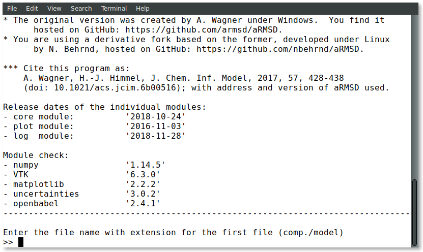

  While it is possible to work in the default dimension of a terminal
  with 80 \times 24 characters, you may miss some of the intermediate
  output provided by =aRMSD= by omission of vertical scrolling.
  Hence, a taller terminal is recommended, e.g., 80 \times
  43 characters, as shown in figure [[fig-large-welcome]].  However, a
  terminal wider than 80 characters per line will not provide
  additional benefit.

  #+ATTR_LATEX:    :width 15cm
  #+ATTR_HTML:     :width 75%
  #+NAME:    fig-large-welcome
  #+CAPTION: Initial screen display of =aRMSD= in a 80 \times 43 character terminal.
  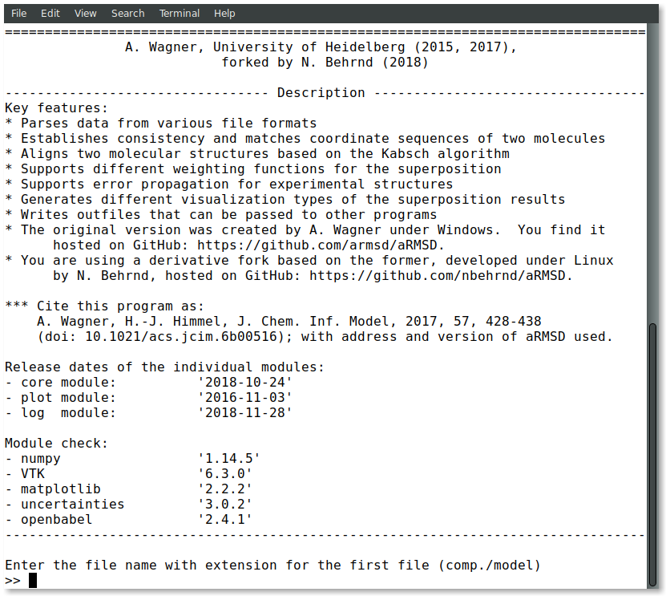

* Example geometric Kabsch test

  This chapter describes a simple /geometric/ Kabsch test of two
  conformers of a small molecule.  Here, the test is /geometric/
  because the contribution of each atom to the final RMSD only depends
  on its atomic position, and the incertitude of this atomic position.
  It is the basic approach in =aRMSD= and suitable to get familiar
  with the program, especially in conjunction with the /workflow
  overview/ this primer includes.

  The test data used are files =M1.xyz= and =M2.xyz= (folder
  =examples=) about the aspirinate anion.  They are derived from
  corresponding =*.cif= found in the CSD data base[fn:CSD] with
  Olex2.[fn:Olex2] Copy these into a location easily accessible for
  you.

  Side note: Depending on the use case, it might be useful, or
  necessary to equally account for atomic properties such as atomic
  masses, total or core electron count, atomic X-ray scattering
  factors, etc.  These options contribute to a /weighted/ Kabsch test
  and represent an advanced used of =aRMSD= described in a different
  chapter.

** Reading the structures

   From your shell, launch the program by command =aRMSD=.

   After the simulated prompt (the =>= sign), enter the complete file
   name (including the file extension) of the first model to load and
   confirm with with =ENTER=.  Note, there is no tab-assisted
   auto-completion of the file name.  If you err with the file name,
   and the model does not exist, you are offered a new prompt.  If you
   err with the file name pointing to an existing model, but are not
   interested to compare with an other model, the simplest
   rectification is to close =aRMSD= with =Ctrl + C= and to start the
   program freshly again.

#   #+ATTR_LATEX:   :width 15cm
#   #+ATTR_HTML:    :width 75%
#   #+NAME:    aRMSD-loadingModels
#   #+CAPTION: Model loading and consistency check by =aRMSD=.
    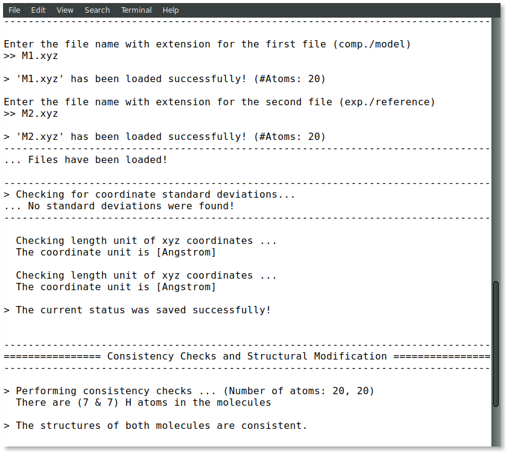

    The program's note

    #+begin_src bash :result nil
      No standard deviations were found!
    #+end_src

    reminds the program's background in crystallography, where atomic
    coordinates may be described with their esd.  Present =aRMSD=
    (version 1.0.0) however is not yet (again) capable to reliably
    process =.cif= files.  With =.xyz= files -- as in this example--
    you don't need to worry about this note.

    Side note: Indeed, it is possible to load different models of
    different file type with different file extensions, such as
    =M1.xyz= for the first, and =M2.pdb= for the second model to
    compare with each other.  While preparing the Kabsch test, as long
    as /consistency checks/ on the two model's total atom count are
    passed, this is not problematic to =aRMSD=.

*** Consideration of hydrogen atoms

    For the Kabsch test ahead, =aRMSD= allows you to include all, or
    to exclude a selection of hydrogens (bond to carbons, or bond to
    group-14 elements).  You equally may neglect all hydrogen atoms
    altogether, too.  This can be useful e.g., for comparing two
    structure models where one has an incomplete set of hydrogen atoms
    as obtained e.g., by X-ray diffraction experiments.

    Your choice here only affects the internal representation of model
    and reference.  Your choice will not edit your input files.

    For the purpose of this primer, all atoms were included in the
    scrutiny, selected by key stroke =3=:

#    #+ATTR_LATEX:   :width 15cm
#    #+ATTR_HTML:    :width 50%
#    #+NAME:    aRMSD-hydrogens
#    #+CAPTION: User defined exclusion / retention of hydrogens in =aRMSD=.
    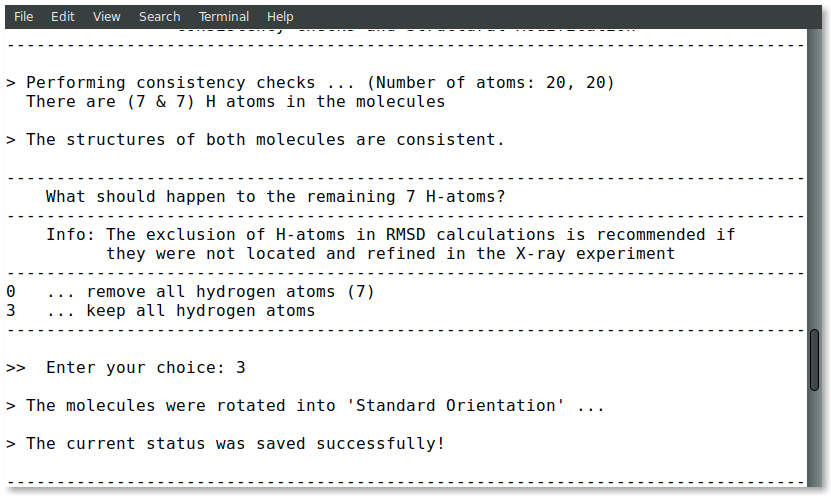

    =aRMSD= then provides a first /guess/ of an /initial alignment/
    the two models.

** User-assisted re-orientation of the models

    =aRMSD= now launches a =vtk=-based widget separate from the
    terminal.  With your mouse, you can tilt, roll, pan, and zoom the
    scene to your preference to learn about this /initial/ alignment
    were the /model/ (red motif) and /reference/ (green motif) already
    share a Cartesian coordinate system in common.  Depending on your
    computer and operating system, it is possible to toggle on/off an
    anaglyph representation, too.

#   #+ATTR_LATEX:   :width 7.5cm
#   #+ATTR_HTML:    :width 50%
#   #+NAME:    aRMSD-structureVisualizerDefault
#   #+CAPTION: Vtk-based structure visualizer by =aRMSD=.
    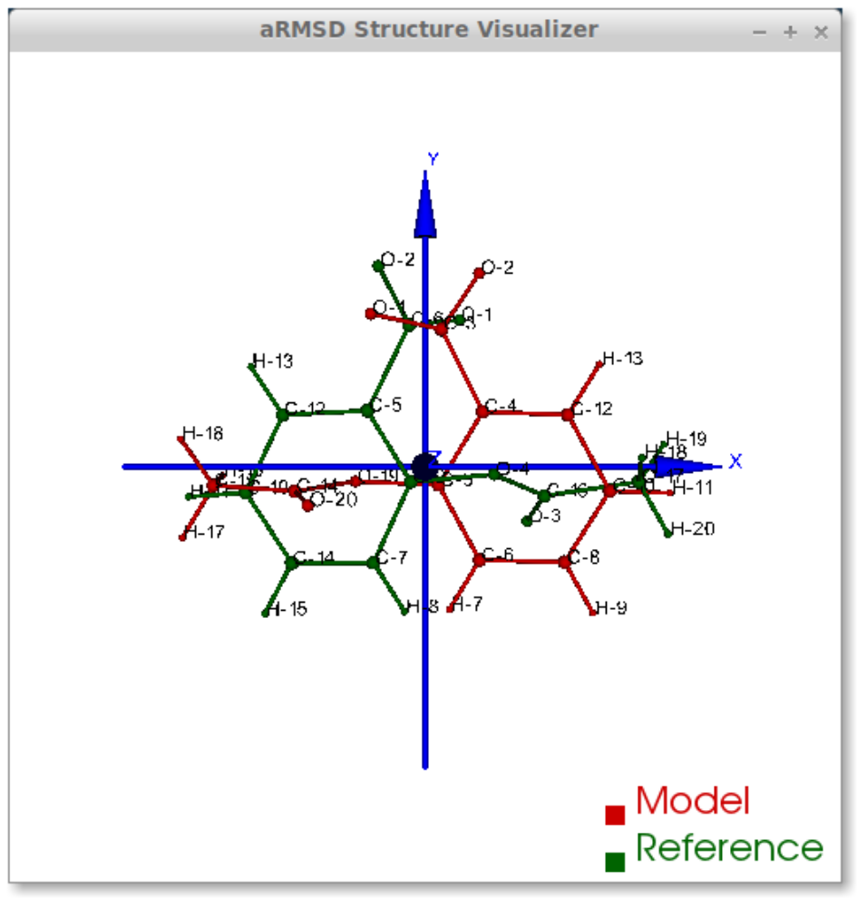

#   #+NAME:    VtkCommands
#   #+CAPTION: Typical commands to interact with the structure visualizer in =aRMSD=.

    |-----------------------------------------+---------------------------|
    | command                                 | function                  |
    |-----------------------------------------+---------------------------|
    | dragging with left mouse button (=LMB=) | tilt the scene            |
    | =CTRL + LMB=                            | roll the scene            |
    | =Shift + LMB=                           | pane the scene            |
    | middle mouse reel                       | zoom the scene            |
    | =r=                                     | return to a home position |
    |-----------------------------------------+---------------------------|
    | =3=                                     | toggle anaglyph display   |
    | =q=, =e=, or =0=                        | close the visualizer      |
    | =s=                                     | save the scene (=*.png=)  |
    |-----------------------------------------+---------------------------|

    Note that the more your mouse is out of the center of the
    visualizer's canvas, the more the mouse-assisted actions
    accelerate.  You may document the match as bitmap with key-stroke
    =s=; the visualizer, unaltered in its default dimension will write
    a =*.png= (2048 \times 2048 px) deposit in your current working
    directory.

    If you are familiar about the alignment shown to you, close the
    visualizer (=q=).  If -- as in the current example -- the two
    model data do not align nicely, the terminal offers you multiple
    symmetry operations to try a better alignment.  Each time you
    select one of the options, =aRMSD= displays a new /initial match/
    of the two in a newly opened instance of the visualizer.

#   #+ATTR_LATEX:   :width 15cm
#   #+ATTR_HTML:    :width 75%
#   #+NAME:    aRMSD-realignmentInterface
#   #+CAPTION: Symmetry operations provided by =aRMSD= to alter and improve the initial alignment of structure "model" and "reference".
    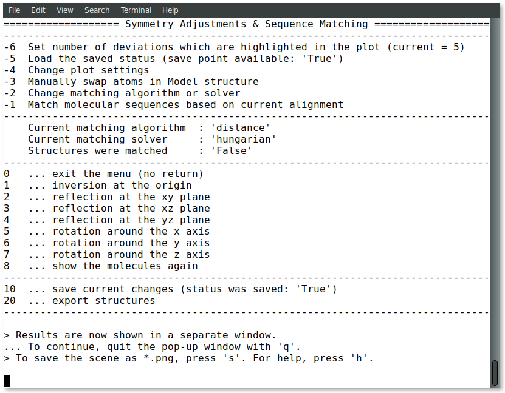

    In the case of this primer, the relative arrangement has to
    undergo an inversion (key-stroke =1=), and an reflection in
    respect to the /xz/-plane (key-stroke =3=).  The approach is
    iterative, and the sequence these operations does
    not matter.  The progress is shown in the figure below.
    Intentionally both alignments shown share the same perspective.

#    #+ATTR_LATEX:   :width 15cm
#    #+ATTR_HTML:    :width 75%
#    #+NAME:    aRMSD-M1M2-initialMatching
#    #+CAPTION: Example of progressively adjusting the relative alignment of structure "model" (=M1.xyz=) and "reference" (=M2.xyz=) in =aRMSD=.  a) After application of an inversion.  b) After subsequent application of inversion and reflection in respect to the /xz/-plane.
    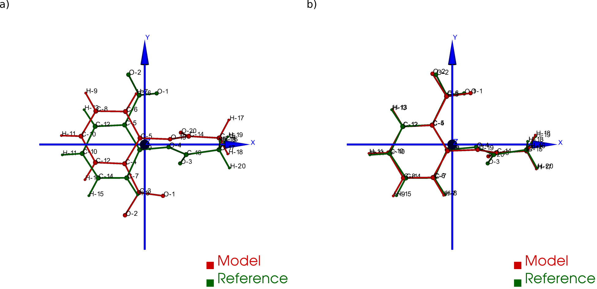

    At this stage, you aim for a fit of the two model structures that
    is /good enough/.  (In the ongoing of this section, as well in
    comparison with the next chapter, you will learn what this refers
    to.)  Once two structure data do overlap -- again, it is /an
    initial/ superposition only -- close the visualizer (keystroke
    =q=) and save this change alignment obtained (with keystroke
    =10=).

** Re-ordering of the atoms

    To proceed in the refinement of the superposition successfully,
    the atoms recognized of both models have to be labeled
    consistently. /One/ approach available in =aRMSD= is the
    Hungarian algorithm, implemented as default strategy.  At the
    current stage of the analysis, this is triggered by hitting =-1=
    (minus one).

    =aRMSD= will again open a =vtk=-visualizer of the two prealigned
    models.  In contrast to the former situation, however, the
    labeling of the atoms of one molecule should match the one of the
    same atoms in the second molecule.  In addition, yellow streaks
    indicate which atoms in /model/ and /reference/ =aRMSD= considers
    as equivalent.

#    #+ATTR_LATEX:   :width 15cm
#    #+ATTR_HTML:    :width 75%
#    #+NAME:    aRMSD-M1M2-Hungarian
#    #+CAPTION: Successful application of the Hungarian algorithm on well aligned structures "model"  and "reference".  Yellow streaks mark atoms of different molecules remote from each other which subsequently will be considered by =aRMSD= as analogous to each other. a) Display in the default perspective of =aRMSD=.  b) Altered perspective of the same "correlation".
    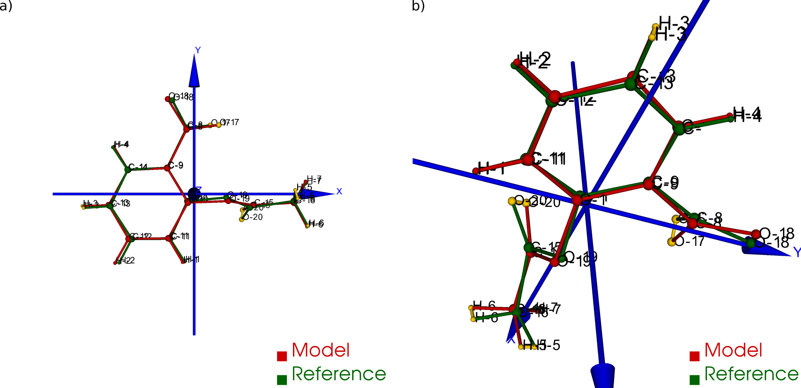

    Since the obtained pre-alignment and match of atom sequences is
    reasonable, close the visualizer (key-stroke =q=), and save the
    intermediate result (key-stroke =10=).

** refinement of the superposition (Kabsch test)

To enter the menu about the Kabsch test, hit now once =0= (zero).
    The interface displayed by =aRMSD= in the terminal changes, and
    you are able to trigger the refinement of the superposition with
    =-1= (minus one).  The now following sequence of calling
    subroutines is /recommended/ to harvest the maximum of relevant
    data =aRMSD= provides.

#    #+ATTR_LATEX:   :width 15cm
#    #+ATTR_HTML:    :width 75%
#    #+NAME:    aRMSD-KabschInterface
#    #+CAPTION: The CLI by =aRMSD= about the Kabsch test.
    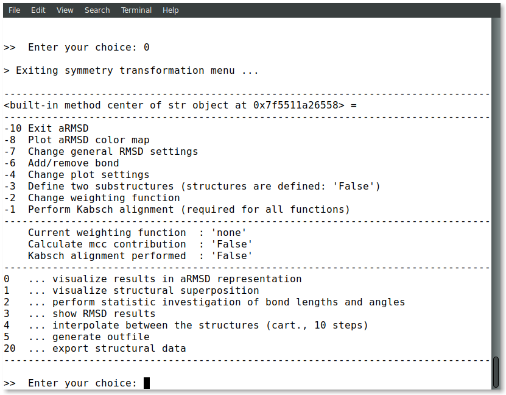

    + Key-stroke =0= (zero) again opens the interactive Vtk-based
      visualizer (subfigure a).  This adapted ball-stick
      representation displays /atom radii/ of the atoms proportional
      to the /relative contribution/ of said atoms to the global RMSD.
      The /atom colors/ of the spheres scales to the absolute
      remaining difference of the two fit structures about said atom
      in Angstroms.  The lateral scale offers an estimate of the
      latter.

#      #+ATTR_LATEX:  :width 15cm
#      #+ATTR_HTML:   :width 75%
#      #+NAME:    aRMSD-diffA-diffB
#      #+CAPTION: Structure display about the refined superposition of structure "model" (=M1.xyz=) and structure "reference" (=M2.xyz=) provided by =aRMSD=.  a) Composite representation, where the /atom radii/ scale to the relative, and the /atom colors/ of the atom to the absolute contribution of said atoms to the global RMSD (reference scale in Angstroms).  b) Wire-model superposition of the two models.
      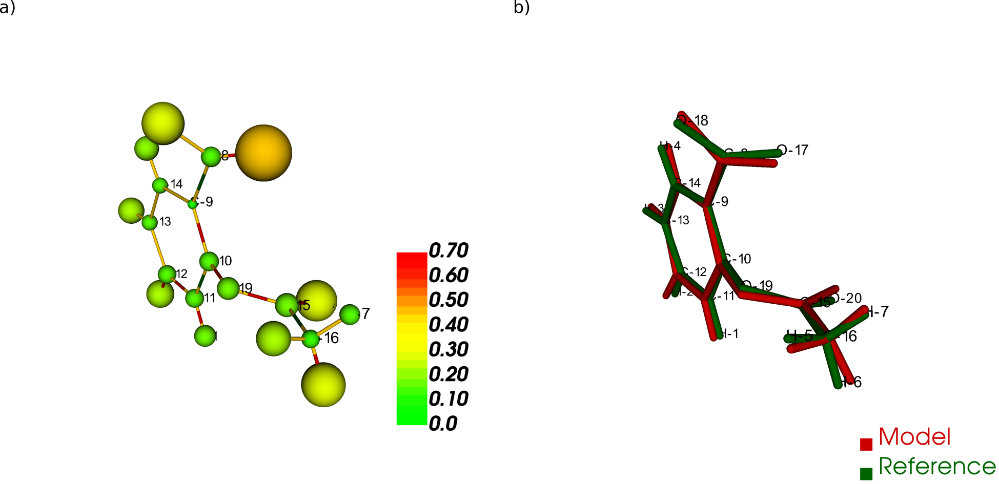

      Some of the bonds depicted /might/ bear a red band in the
      center.  This is to indicate that the same bond in the reference
      model is significantly shorter, than in the tested model.
      Conversely, a green band indicates a bond that is longer.  By
      default, the critical /length difference/ to set these bands
      equals to 0.2 Angstrom.  Bby keystroke =1= (subfigure b), a
      wireframe model of the finalized superposition.

      Clicking /on/ a representation of one, two, three, or four atoms
      selects them to read out to the final RMSD data about the
      corresponding position; or corresponding difference in distance,
      angle; or dihedral angle between model and reference.  These
      readouts are non-permanent and provided /only/ on the terminal.

#      #+ATTR_LATEX:  :width 15cm
#      #+ATTR_HTML:   :width 75%
#      #+NAME:    aRMSD-diffTest
#      #+CAPTION: Example of subsequent selection of atom C11, C12, C13 and C14 to readout differences in position (or angle) in the refined superposition of the two structures =M1.xyz= and =M2.xyz=.
      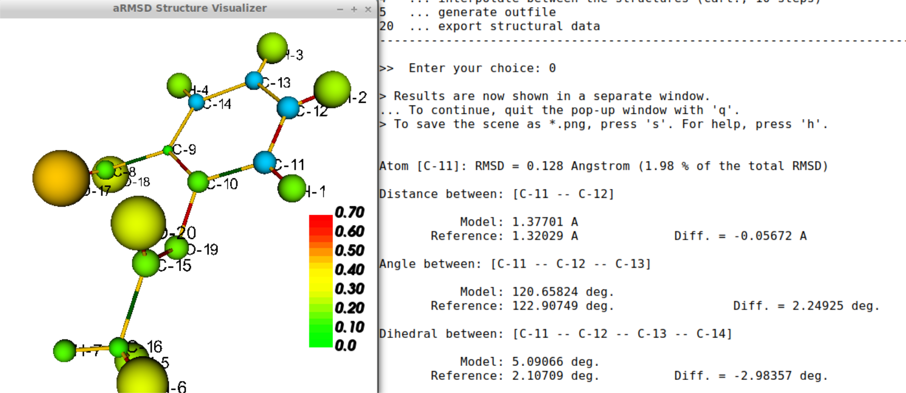

      The underlying routine providing the readouts is agnostic about
      the atom type, allowing both the selection of hydrogen atoms, as well
      as non-H atoms.  The atoms of interest need not be adjacent,
      either, which may be of interest comparing distances and angles.
      Again, you close the visualizer with keystroke =q=.

    + With key-stroke =2=, an additional determination of statistics,
      and generation of synoptic diagrams is provided by the
      =matplotlb= library.  At your discretion, you can pan and zoom
      to the region of interest within the diagrams.  Depending on
      your setup, the diagrams can then be exported for instance as
      =.png=, =.pdf=, or =.tikz=.

#      #+ATTR_LATEX:   :width 15cm
#      #+ATTR_HTML:    :width 75%
#      #+NAME:     aRMSD-M1M2-statistics
#      #+CAPTION:  Synoptic statistics plots about the successfully comparison comparing the refined alignment of model =M1.xyz= and =M2.xyz= by =aRMSD=.
      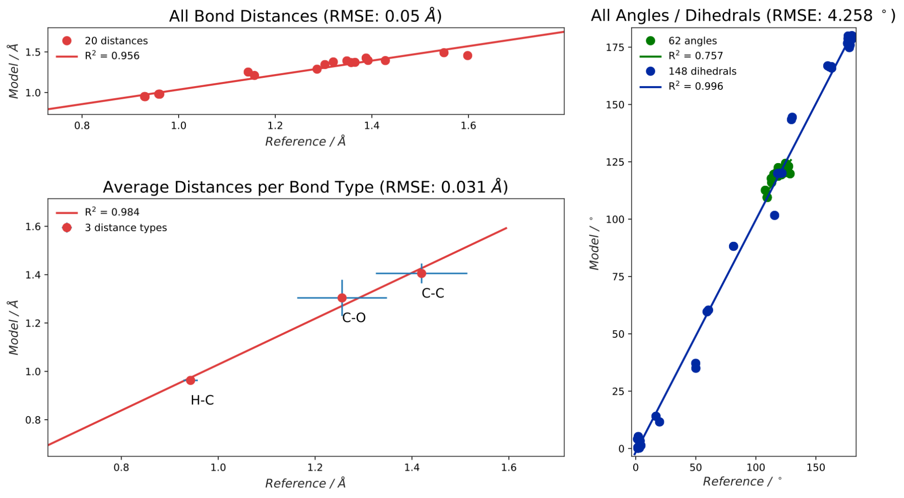

      The window about the statistics plots may be closed either by
      mouse, or again key-stroke =q=.

    + With keystroke =3=, the program offers you a first decomposition
      about RMSD's contributions onto the terminal.  Though your shell
      might visually truncate some of the results, it is useful to
      invoke this subroutine once -- even blindly -- because /this
      step's results/ will enter the permanent record log written of
      the next.

#      #+ATTR_LATEX:   :width 15cm
#      #+ATTR_HTML:    :width 75%
#      #+NAME:    aRMSD-M1M2SuperposQuality
#      #+CAPTION: Terminal output of the refined superposition by =aRMSD=
      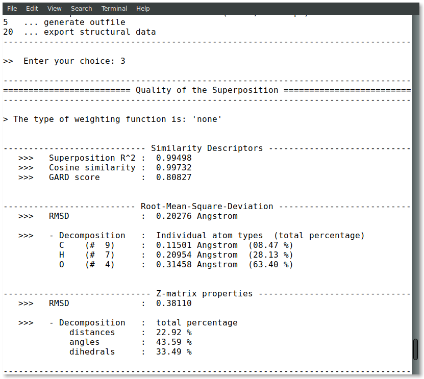

    + Key-stroke =5= initiates =aRMSD= to write a permanent record
      =aRMSD_log-file.out= as plain text.  This recapitulates setup
      and results of the similarity measurement, such as the rotation
      matrix applied to match the two structure models, or further
      figures of merit (e.g., cosine similarity, GARD similarity).

      In section =reference outputs=, the primer includes an example
      of =aRMSD_logfile.out=.

** general hints

   Last, but not least, a few words of caution:

  + It is normal that performing the same computation a twice, with
    the same files, in a different operating system yields results
    /slightly different/ from each other.
  + There are multiple "dialects" about the =.pdb= format, which may
    require the model data you have to be converted into =.xyz=, for
    example with =babel=[fn:babel] using a pattern of

    #+BEGIN_SRC shell :results nil
      babel input.pdb -O converted.xyz
    #+END_SRC

    The conversion into =.xyz= may strip symmetry of the structure
    model, and thus affect file size.

* Example of a failed Kabsch test

  This section compiles hints of various degrees to recognize the
  Kabsch test /might be/, or actually /is/ on the wrong track.

  Let's presume the program's guess of a prealignment wasn't yet
  optimal, and the manual adjustment by symmetry operations
  incomplete.  Then, running the Hungarian algorithm to synchronize
  the atom sequence in /model/ and /reference/ may fail.  Or, though
  successful in this task, the subsequent representation highlights
  the corresponding atoms by yellow struts running largely across the
  coordinate system in common.  The figure below displays such at
  level where atoms are labeled (a), and corresponding atom is assigned
  (b).

 # #+ATTR_LATEX:   :width 15cm
 # #+ATTR_HTML:    :width 75%
 # #+NAME:    aRMSD-badAlignmentOnlyInversion-stepA
 # #+CAPTION: Example of an ill-fated comparison of structure =M1.xyz= with structure =M2.xyz= with =aRMSD=, step 1/3.  a) The symmetry operation applied accounts only for inversion of the relative orientation of the two models.  Consequently b), the number of atoms deemed analogous to each other yet marked by yellow streaks is higher, than in the "best match" (previous chapter).  In addition, the streaks now pass largely /across/ the structure models.
  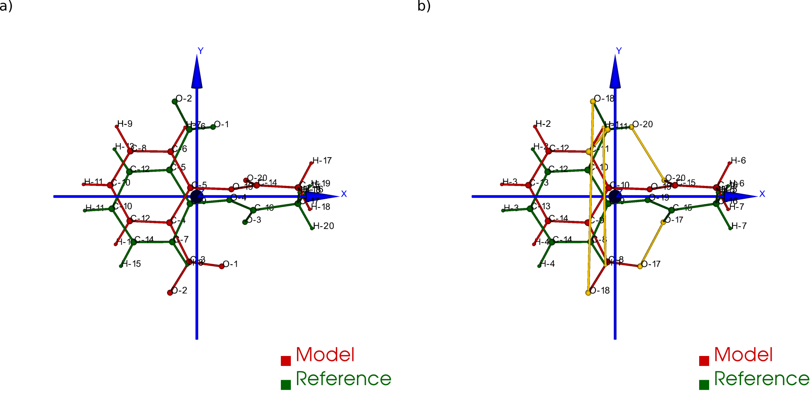

  While mathematically still possible to perform a Kabsch test,
  another warning indicator are atoms depicted with unusual large
  absolute contribution to the overall final RMSD
  (subfigure a). Depending on the structure model and its molecular
  symmetry in question, some atoms might be more affected by a
  misalignment, than others.  Trying to connect the atoms of either
  /model/, or /reference/, =aRMSD= might depict unusually distorted
  structures (subfigure b), too

 # #+ATTR_LATEX:  :width 15cm
 # #+ATTR_HTML:   :width 75%
 # #+NAME:     aRMSD-badAlignmentOnlyInversion-stepB
 # #+CAPTION:  Example of an ill-fated comparison of structure =M1.xyz= with structure =M2.xyz= with =aRMSD=, step 2/3.  a) Composite display, b) classical superposition representation.
  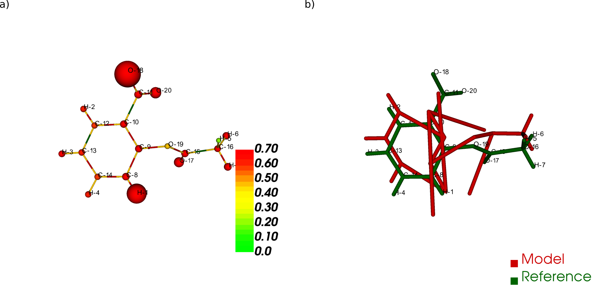

  Eventually, the visual inspection (and comparison with other
  attempts) of the statistic diagrams should complement the
  reading of the corresponding optional =aRMSD_logfile.out=.

 # #+ATTR_LATEX:   :width 15cm
 # #+ATTR_HTML:    :width 75%
 # #+NAME:    aRMSD-badAlignmentOnlyInversion-stepC
 # #+CAPTION: Example of an ill-fated comparison of structure =M1.xyz= with structure =M2.xyz= with =aRMSD=, 3/3.  Synoptic statistics plots.
  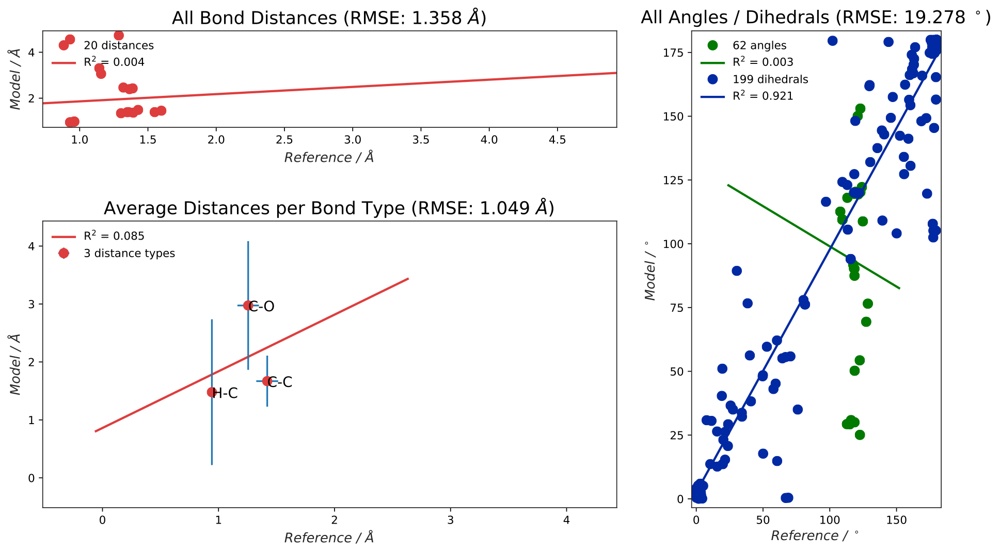

[fn:CSD]  Model =M1.xyz= and =M1.pdb= are derivated from entry
=FEHGAB= of CCDC's CSD file; primary reference: Santana, M. D.;
Lozano, A. A.; García, G.; López, G.; Pérez, J. Five-Coordinate
Nickel(ii) Complexes with Carboxylate Anions and Derivatives of
1,5,9-Triazacyclododec-1-Ene: Structural and1 H NMR Spectroscopic
Studies. /Dalton Trans./ *2005*, No. 1,
104–109. https://doi.org/10.1039/B413547D.  =M2.xyz= and =M2.pdb= are
derivated from entry =IVUYEE= of CCDC's CSD file; primary reference:
Poyraz, M.; Banti, C. N.; Kourkoumelis, N.; Dokorou, V.; Manos, M. J.;
Simčič, M.; Golič-Grdadolnik, S.; Mavromoustakos, T.; Giannoulis,
A. D.; Verginadis, I. I.; Charalabopoulos, K.; Hadjikakou,
S. K. Synthesis, Structural Characterization and Biological Studies of
Novel Mixed Ligand Ag(I) Complexes with Triphenylphosphine and Aspirin
or Salicylic Acid. /Inorg. Chim. Acta/ *2011*, /375/ (1),
114–121. https://doi.org/10.1016/j.ica.2011.04.032.

[fn:Olex2] Dolomanov, O. V.; Bourhis, L. J.; Gildea, R. J.; Howard,
J. A. K.; Puschmann, H. OLEX2 : A Complete Structure Solution,
Refinement and Analysis Program. /J. Appl. Crystallogr./ *2009*, /42/
(2), 339–341. https://doi.org/10.1107/S0021889808042726.  Olex2,
version 1.2.10.

[fn:babel] Open Babel, [[http://openbabel.org/]].  For further details,
see O’Boyle, N. M.; Banck, M.; James, C. A.; Morley, C.;
Vandermeersch, T.; Hutchison, G. R. Open Babel: An Open Chemical
Toolbox. /J Cheminform/ *2011*, /3/
(1), 33. https://doi.org/10.1186/1758-2946-3-33.
